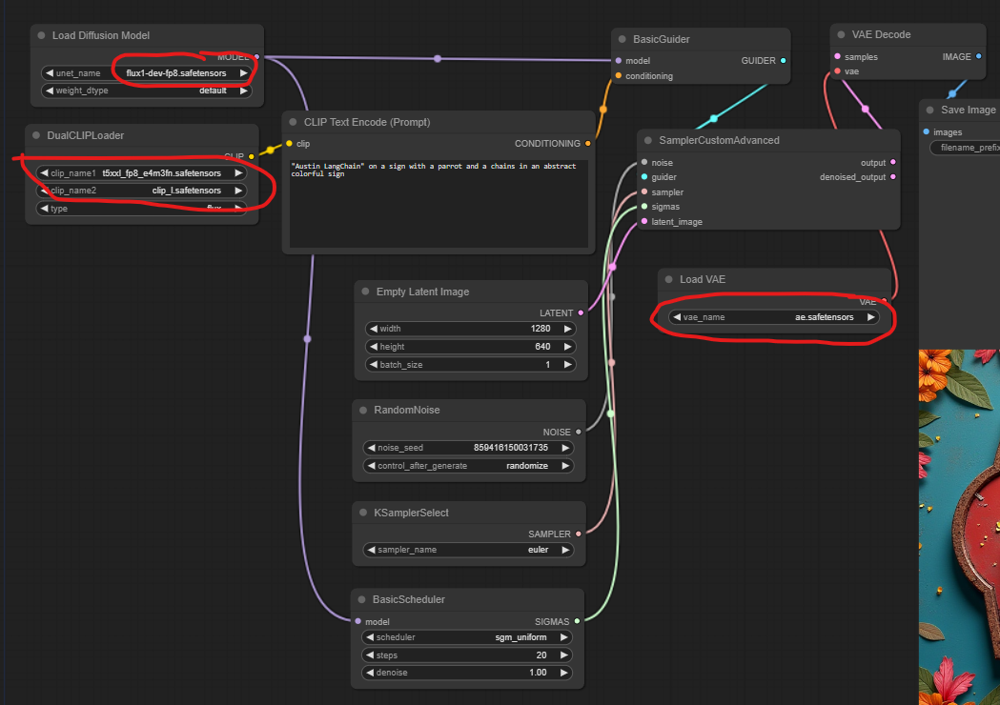

# ComfyUI and Flux.1 🖼️🚀

This guide will help you get up and running with [Flux.1](https://blackforestlabs.ai/) in [ComfyUI](https://github.com/comfyanonymous/ComfyUI).

## GitHub Social Banner 🖼️

The default template in this workflow is great for creating GitHub Social banners. The default size (1280x640) is perfect for this purpose. These images should work as long as they are less than one megabyte, which is often the case with the output from this workflow.

TODO: Find a way to compress the output images further to ensure they are always below 1MB.

## Getting Started 🏁

1. Install [ComfyUI](https://github.com/comfyanonymous/ComfyUI) following the instructions for your operating system.
2. Download the required model files and place them in the correct directories (see below).
3. Launch ComfyUI.
4. Load the included workflow file in ComfyUI.
5. Enter your prompt in the designated text input node.

## Required Model Files 📁

### UNET Models (Place in ComfyUI/models/unet)
Download the compressed versions of Flux.1 from [Kijai/flux-fp8](https://huggingface.co/Kijai/flux-fp8/tree/main):
- flux1-dev-fp8.safetensors
- flux1-schnell-fp8.safetensors

### Text Encoders (Place in ComfyUI/models/clip)
Download from [comfyanonymous/flux_text_encoders](https://huggingface.co/comfyanonymous/flux_text_encoders/tree/main)

### VAE File (Place in ComfyUI/models/vae)
Download [ae.safetensors](https://huggingface.co/black-forest-labs/FLUX.1-schnell/blob/main/ae.safetensors) from the Flux.1 HuggingFace repository

## Setting Up the Workflow 🛠️

1. In ComfyUI, load the included workflow file.
2. Select the appropriate models in the workflow nodes.
3. Enter your desired prompt in the text input node.

Here's an example of how your ComfyUI workflow should look:

This image shows the correct way to wire the nodes in ComfyUI for the Flux.1 workflow. 🔌

## Acknowledgements 🙏

Special thanks to [Aitrepreneur](https://www.youtube.com/@Aitrepreneur) on YouTube for their helpful video on setting up Automatic1111. Their tutorial, ["How to Install Stable Diffusion on Windows for FREE"](https://www.youtube.com/watch?v=stOiAuyVnyQ), was instrumental in getting started with AI image generation tools.
